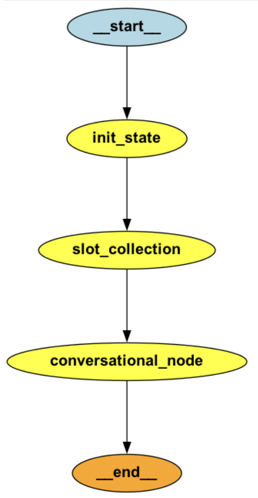

# Slot collection PoC with LangGraph and Structured Output

This PoC aims at proving how we can leverage LangGraph and Structured Output to make slot collection robust to 
different user inputs and make the behaviour consistent over time.

The purpose of this PoC is not only to improve on any other slot collection solutions implemented in the past,
but also to propose a new standardised way to collect slots, which can be applied to different use cases. 


## Base solution

The base solution implements a **simple graph with 3 nodes**:
- `init_state`: this node is responsible for setting the state, which includes the slots collected so far. The slots
are initialised from scratch at the start of the conversation or provided by the output of the previous call to the 
graph when the conversation is in progress. This is because we want to build upon information collected in previous 
iterations instead of extracting the same slots over and over by looking at the message history, which can cause issues 
especially when the message history becomes quite long. 
- `slot collection`: first call to the LLM responsible for extracting the slots from the user input
- `conversational node`: second call to the LLM to handle the conversation with the user

<p align="center">

</p>

Making two LLMs calls ensures we can define the problem of extracting information from text and collecting new slots 
asking questions to the user as two separate tasks, which makes the solution more modular and the prompts easier to 
manage.

The first LLM call, which is responsible for extracting information from the text, leverages structured output. 
Structured output ensures the LLM output is formatted according to our needs, which can be specified programmatically 
by defining a pydantic model.

Example:

```
class BookCar(BaseModel):
    """Information necessary to request a car booking."""

    pick_up_location: Optional[str] = Field(default=None, description="The pick up location for the car rental")
    pick_up_date: Optional[str] = Field(default=None, description="Pick up date")
    pick_up_time: Optional[str] = Field(default=None, description="Pick up time")
    drop_off_location: Optional[str] = Field(default=None, description="The drop off location for the car rental")
    drop_off_date: Optional[str] = Field(default=None, description="Drop off date")
    drop_off_time: Optional[str] = Field(default=None, description="Drop off time")
    car_type: Optional[str] = Field(default=None, description="The type of car the user wants to rent")
    preferred_vendor: Optional[str] = Field(default=None, description="Car vendor (e.g. SIXT, Avis, etc..)")
    car_loyalty_number: Optional[str] = Field(default=None, description="Car loyalty number (e.g. Avis loyalty number)")
```

## Validators
Some validators have been implemented for the date parsing. <br />

Please note that parsing of the dates is not let to the LLM. This is again to make the task of parsing the date more 
robust and less prone to errors, with the minor downside of asking the user for clarification in some edge cases where 
a programmatic approach doesn't reach (i.e. Monday in three weeks).  

Parsing of the dates happens in the `slot_collection` node after the LLM response.

The library used for parsing the dates is **dateparser**, which is capable of resolving the following cases 
(also included in `test_date_resolution.py`):
- standard date format (DD/MM/YEAR, YEAR/MM/DD)
- relative dates (i.e. today, tomorrow, in 3 days, etc ...)
- week-based relative dates (i.e. in one week, in two weeks, ...)
- month-based relative dates (i.e. in one month, in two months, ...)
- weekday references (i.e. Monday, Tuesday, Wednesday, ...)
- future dates that should resolve to next year

The following date validation logic has been implemented:
- dates in the past are flagged as invalid
- start date after end date of the segment is flagged as invalid

